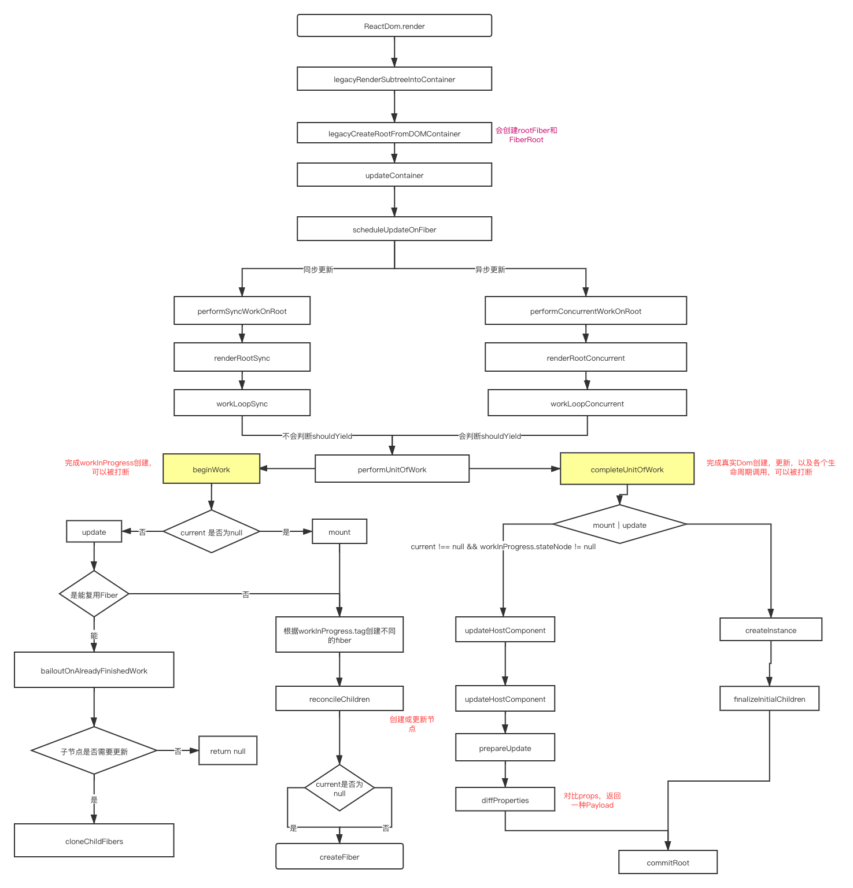

# 首页
> 本文当github地址为：https://github.com/xuelongm/react-docs
欢迎各位大佬来issues

在开始本文档之前已阅读了近两个月的源码，整个过程比想象的要难，React源码的复杂度和Vue相比不在一个量级上，其主要难点有两方面：
- 涉及很多的概念，包括Fiber，双缓存，lane模型，小顶堆（调度时使用），分片渲染（concurrent模式），requestIdlecallback等等。
- React调度模型，React的调度模型包括两个部分，一是Line模型，二是React Scheduler模型，在调度过程中还会涉及两个模型的相互转换，这就更加复杂难懂。
但是，阅读源码不仅能更加深入的理解框架的运行流程，更能从源码中学习到框架设计思想和问题解决方案。

> 本文档的主旨是为了打造一套简单易懂React源码解析文档，帮助想要了解React源码的同学建立起React源码的整体架构。 为了保证观点的正确性，本文全部观点都赖在官方文档，以及github。

# React源码难学吗？
说实话，难，非常难。我从开始看源码到现在（6月12号）前后差不多是三个月的时间，在这三个月的时间看了大量的文章以及视频，只能说把React大体框架梳理出来了，但是很多细节还是没有完全掌握。真的是路漫漫其修远兮，吾将上下而求索。
# React源码怎么学习呢？
学习React源码最忌讳的就是纠结每个函数的实现，这样容易让我们进入无限函数调用或递归中，最终会导致我们像盗梦空间一样，分不清自己是在现实还是在梦中。

我的学习过程是这样的：
- 找到React源码中最主要的模块，包括react，react-dom，react-reconciler，scheduler。
- 理解各个模块的调用关系以及各个模块所负责的职责。
- 对Render阶段和Commit阶段所完成的职责有个清晰的认识。
- 对React中的对象以及对象属性有一个清晰的认识。
- 深入了解React中的调度系统。

# React的核心是什么？
回归主题，React的核心是什么，我总结了下：
- 更新机制
- 双缓存
- Fiber树
- React中的调度系统
这几项我认为是React中最难的部分，如果翻过这几座高山，React源码其实很简单。通过这几部分的相互调用就能完成整个React大厦的构建。下面我通过导图的方式来展示下Render过程的调用流程图：
 

 
