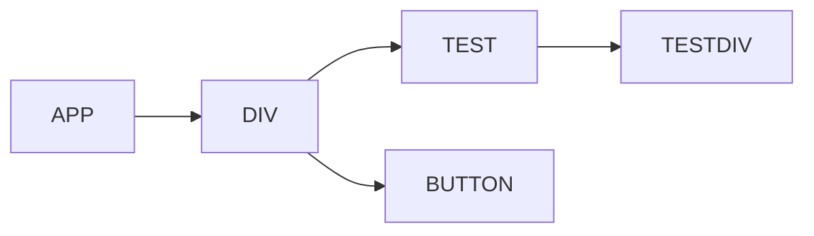
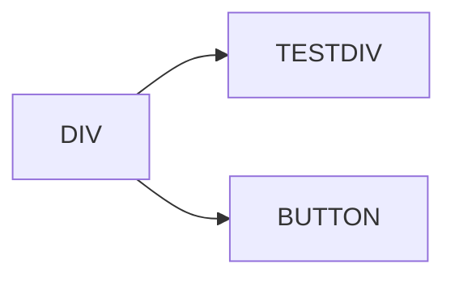
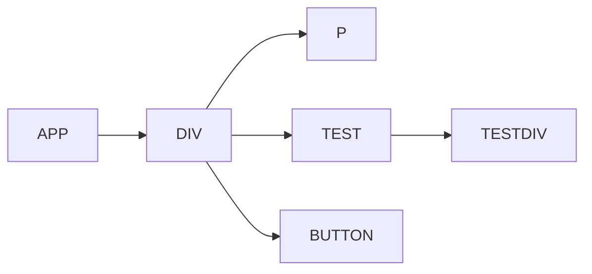
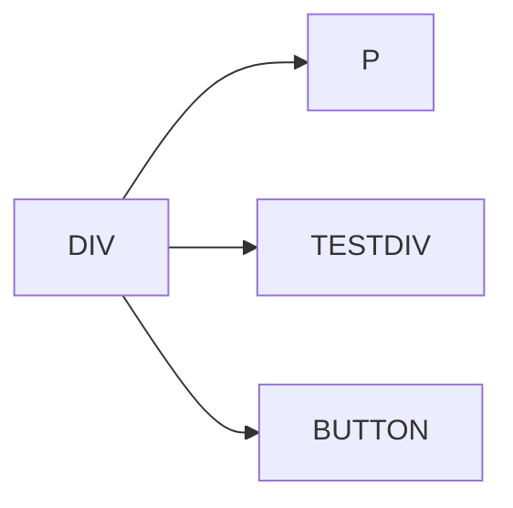

# commit 阶段

上一节我们讲完了render阶段，本章节我们将要进入commit阶段的学习。

在进入章节之前要牢记几件事：

- 用于副作用的effectList单项链表已形成，`rootFiber.firstEffect`指向当前要更新的第一个节点
- 用于`mount`的dom创建
- 

commit阶段的入口函数是`commitRoot()`，此函数在`performSyncWorkOnRoot()`和`finishConcurrentRender()`函数中调用。在commit阶段是同步执行的，不可以被打断，也就是说所有的更新需要一次性完成。

我们以`performSyncWorkOnRoot()`为例，看看`commitRoot()`的调用：

```tsx
function performSyncWorkOnRoot(root) {

    // ...省略大部分代码
    // render阶段的入口函数
    exitStatus = renderRootSync(root, lanes);
    // ...省略代码
    // commitRoot函数调用
    const finishedWork: Fiber = (root.current.alternate: any);
    root.finishedWork = finishedWork;
    root.finishedLanes = lanes;
    commitRoot(root);
    // ...省略代码
}
```

有上述代码可知，在调用render阶段完成后，获取`workInProgress`的`rootFiber`节点，并将`rootFiber`节点传入`commitRoot`中。现在就让我们揭开`commitRoot`的神秘面纱。

😭，commitRoot代码就5行，只是用`runWithPriority`调起一个任务，也就是说所有的逻辑都是在`commitRootImpl`函数中

```tsx
function commitRoot(root) {
    const renderPriorityLevel = getCurrentPriorityLevel();
    runWithPriority(
      ImmediateSchedulerPriority,
      commitRootImpl.bind(null, root, renderPriorityLevel),
    );
    return null;
}
```

`commitRootImpl`函数全部代码有371行，看这么长的代码就是一种折磨，不过我们可以只关注代码中最主要的功能就好，主要有以下几个功能：

- 处理rootFiber节点，将rootFiber节点加入到effectList中
- 调用`commitBeforeMutationEffects`函数（before mutation）
- 调用`commitMutationEffects`函数（mutation）
- 调用`commitLayoutEffects`函数（layout）

那么这个三个函数有做了写什么呢？下面我们一一分析

```tsx
function commitRootImpl(root, renderPriorityLevel) {
    // ...省略代码

    // 获取effectList
    let firstEffect;
    if (finishedWork.flags > PerformedWork) {
      // 因为rootFiber在render阶段不会加入到链表，此时我们要把rootFiber节点加入到链表中
      if (finishedWork.lastEffect !== null) {
        finishedWork.lastEffect.nextEffect = finishedWork;
        firstEffect = finishedWork.firstEffect;
      } else {
        firstEffect = finishedWork;
      }
    } else {
      // There is no effect on the root.
      firstEffect = finishedWork.firstEffect;
    }

    // ...省略代码
    // 操作DOM之前的操作
    nextEffect = firstEffect;
    do {
      // 会调用getSnxapshotBeforeUpdate函数
      commitBeforeMutationEffects();
    } while (nextEffect !== null);

    // We no longer need to track the active instance fiber
    focusedInstanceHandle = null;

    if (enableProfilerTimer) {
      // Mark the current commit time to be shared by all Profilers in this
      // batch. This enables them to be grouped later.
      recordCommitTime();
    }

    // The next phase is the mutation phase, where we mutate the host tree.
    // 此阶段会修改DOM
    nextEffect = firstEffect;
    do {
      // 解绑ref，调用useLayoutEffect销毁函数, 调用DOM操作
      commitMutationEffects(root, renderPriorityLevel);
    } while (nextEffect !== null);

    // ...省略代码
    // 将workProgress 赋值到当前的current
    // 此处很重要
    root.current = finishedWork;

    // 操作DOM树
    nextEffect = firstEffect;
    do {
      // 调用生命周期，调用useLayoutEffect，讲useEffect放入到数组中，绑定ref
      commitLayoutEffects(root, lanes);å
    } while (nextEffect !== null);
  
    //...省略代码
  
    return null;
}
```

## beforeMutation

- 处理blur和focus相关逻辑
- 对于class component类型，如果有`Snapshot`，会在`commitBeforeMutationEffectOnFiber`中调用`getSnapshotBeforeUpdate`
- 调用useEffect

```tsx
function commitBeforeMutationEffects() {
  while (nextEffect !== null) {
    const current = nextEffect.alternate;

    if (!shouldFireAfterActiveInstanceBlur && focusedInstanceHandle !== null) {
     ]// 处理blur和focus相关逻辑
    }

    const flags = nextEffect.flags;
    if ((flags & Snapshot) !== NoFlags) {
      setCurrentDebugFiberInDEV(nextEffect);
      // 如果current 为ClassComponent 则会调用getSnapshotBeforeUpdate
      commitBeforeMutationEffectOnFiber(current, nextEffect);

      resetCurrentDebugFiberInDEV();
    }
    if ((flags & Passive) !== NoFlags) {
      // 调度effect
      if (!rootDoesHavePassiveEffects) {
        rootDoesHavePassiveEffects = true;
        scheduleCallback(NormalSchedulerPriority, () => {
          flushPassiveEffects();
          return null;
        });
      }
    }
    nextEffect = nextEffect.nextEffect;
  }
}
```

### `getSnapshotBeforeUpdate`调用

我们知道在React16后，componentWillxxx生命周期都加上了`UNSAFE_`前缀。这是因为这些生命周期都是在render阶段调用的，而在concurrent模式下render阶段可以被打断和重新调用，也就会导致这些方法多次的调用。

而`getSnapshotBeforeUpdate`是在commit阶段调用的，commit阶段是同步执行的，所以不会出现多次调用的情况。

如果在Class Compenent中添加了`getSnapshotBeforeUpdate`函数，再添加`UNSAFE_componentWillMount/componentWillMount`，`UNSAFE_componentWillReceiveProps/componentWillReceiveProps`和`UNSAFE_componentWillUpdate/componentWillUpdate`都不会在被调用

```tsx
const hasNewLifecycles =
    typeof getDerivedStateFromProps === 'function' ||
    typeof instance.getSnapshotBeforeUpdate === 'function';

 if (
      !hasNewLifecycles &&
      (typeof instance.UNSAFE_componentWillUpdate === 'function' ||
        typeof instance.componentWillUpdate === 'function')
    ) {
      if (typeof instance.componentWillUpdate === 'function') {
        instance.componentWillUpdate(newProps, newState, nextContext);
      }
      if (typeof instance.UNSAFE_componentWillUpdate === 'function') {
        instance.UNSAFE_componentWillUpdate(newProps, newState, nextContext);
      }
    }
```

总而言之，`getSnapshotBeforeUpdate`是为了解决异步调用过程中的多次调用问题，我们在代码中应该尽量使用`getSnapshotBeforeUpdate`来代替原来的生命周期。

### 调用useEffect

在beforeMutitation阶段，会将useEffect加入到调度任务中，详细解析会在后面讲解useEffect时详细讲解。

```tsx
 // 调度effect
if (!rootDoesHavePassiveEffects) {
  rootDoesHavePassiveEffects = true;
  // 异步调度useEffect
  scheduleCallback(NormalSchedulerPriority, () => {
    flushPassiveEffects();
    return null;
  });
}
```

那么React为什么会异步调度useEffect呢？

与 `componentDidMount`、`componentDidUpdate` 不同的是，传给 `useEffect` 的函数会在浏览器完成布局与绘制**之后**，在一个延迟事件中被调用。这使得它适用于许多常见的副作用场景，比如设置订阅和事件处理等情况，因为绝大多数操作不应阻塞浏览器对屏幕的更新。

然而，并非所有 effect 都可以被延迟执行。例如，一个对用户可见的 DOM 变更就必须在浏览器执行下一次绘制前被同步执行，这样用户才不会感觉到视觉上的不一致。（概念上类似于被动监听事件和主动监听事件的区别。）React 为此提供了一个额外的 [`useLayoutEffect`](https://zh-hans.reactjs.org/docs/hooks-reference.html#uselayouteffect) Hook 来处理这类 effect。它和 `useEffect` 的结构相同，区别只是调用时机不同。

虽然 `useEffect` 会在浏览器绘制后延迟执行，但会保证在任何新的渲染前执行。在开始新的更新前，React 总会先清除上一轮渲染的 effect。

> [以上来自官网](https://zh-hans.reactjs.org/docs/hooks-reference.html#timing-of-effects)

### 总结

在beforeMutation阶段会做三件事：

- 处理blur和focus DOM节点
- 调度`getSnapshotBeforeUpdate`生命周期
- 调度useEffect（注意是调度，不是调用）

## Mutation阶段

mutation阶段的入口是`commitMutationEffects` 

```tsx
nextEffect = firstEffect;
do {
  // mutation阶段的入口函数
  commitMutationEffects(root, renderPriorityLevel);
} while (nextEffect !== null);
```

`commitMutationEffects`函数如下：

```tsx
function commitMutationEffects(
root: FiberRoot,
 renderPriorityLevel: ReactPriorityLevel,
) {
  while (nextEffect !== null) {
    setCurrentDebugFiberInDEV(nextEffect);

    const flags = nextEffect.flags;

    if (flags & ContentReset) {
      commitResetTextContent(nextEffect);
    }

    if (flags & Ref) {
      const current = nextEffect.alternate;
      if (current !== null) {
        // 解绑ref
        commitDetachRef(current);
      }
      if (enableScopeAPI) {
        // 下面是临时方案，可以忽略
        if (nextEffect.tag === ScopeComponent) {
          commitAttachRef(nextEffect);
        }
      }
    }

    const primaryFlags = flags & (Placement | Update | Deletion | Hydrating);
    switch (primaryFlags) {
        // 插入节点
      case Placement: {
        commitPlacement(nextEffect);
        // Clear the "placement" from effect tag so that we know that this is
        // inserted, before any life-cycles like componentDidMount gets called.
        // TODO: findDOMNode doesn't rely on this any more but isMounted does
        // and isMounted is deprecated anyway so we should be able to kill this.
        nextEffect.flags &= ~Placement;
        break;
      }
			// 插入并更新节点
      case PlacementAndUpdate: {
        commitPlacement(nextEffect);
        // Clear the "placement" from effect tag so that we know that this is
        // inserted, before any life-cycles like componentDidMount gets called.
        nextEffect.flags &= ~Placement;

        // Update
        const current = nextEffect.alternate;
        commitWork(current, nextEffect);
        break;
      }
      // 服务端渲染 ssr
      case Hydrating: {
        nextEffect.flags &= ~Hydrating;
        break;
      }
      // 服务端渲染
      case HydratingAndUpdate: {
        nextEffect.flags &= ~Hydrating;

        // Update
        const current = nextEffect.alternate;
        commitWork(current, nextEffect);
        break;
      }
      // 更新
      case Update: {
        const current = nextEffect.alternate;
        commitWork(current, nextEffect);
        break;
      }
      // 删除
      case Deletion: {
        commitDeletion(root, nextEffect, renderPriorityLevel);
        break;
      }
    }

    resetCurrentDebugFiberInDEV();
    nextEffect = nextEffect.nextEffect;
  }
}
```

`commitMutationEffects`遍历全部的effectList，对每个节点做如下处理（忽略SSR相关）

- 重置text
- 解绑ref
- 根据Fiber节点的`flag`类型，决定对DOM节点要做的操作，包括增删改

### 增（Placement）

增加功能的入口为`commitPlacement`，`commitPlacement`代码大致如下：

```tsx
function commitPlacement(finishedWork: Fiber): void {
  	// 当前环境支持Mutation
    if (!supportsMutation) {
      return;
    }

  	// 获取有DOM节点的parent节点，tag类型包括HostComponent，HostRoot，HostPortal，FundamentalComponent
    const parentFiber = getHostParentFiber(finishedWork);
		// DOM Parent
    let parent;
  	// 是否为root container
    let isContainer;
    const parentStateNode = parentFiber.stateNode;
    switch (parentFiber.tag) {
      case HostComponent:
        parent = parentStateNode;
        isContainer = false;
        break;
      case HostRoot:
        parent = parentStateNode.containerInfo;
        isContainer = true;
        break;
      case HostPortal:
        parent = parentStateNode.containerInfo;
        isContainer = true;
        break;
      case FundamentalComponent:
        if (enableFundamentalAPI) {
          parent = parentStateNode.instance;
          isContainer = false;
        }
        // eslint-disable-next-line-no-fallthrough
      default:
        invariant(
          false,
          'Invalid host parent fiber. This error is likely caused by a bug ' +
          'in React. Please file an issue.',
        );
    }
    if (parentFiber.flags & ContentReset) {
      // 重置textContent
      resetTextContent(parent);
      // Clear ContentReset from the effect tag
      parentFiber.flags &= ~ContentReset;
    }

  	// 获取当前节点的兄弟节点
    const before = getHostSibling(finishedWork);
  
 		// 插入节点
    if (isContainer) {
      insertOrAppendPlacementNodeIntoContainer(finishedWork, before, parent);
    } else {
      insertOrAppendPlacementNode(finishedWork, before, parent);
    }
}
```

`commitPlacement`主要完成一下几件事：

- 获取有DOM节点的Fiber节点，入口函数为`getHostParentFiber`
- 获取Parent DOM节点
- 获取当前节点的DOM节点的兄弟DOM节点，入口函数为`getHostSibling`
- 插入节点，入口函数为`insertOrAppendPlacementNodeIntoContainer`和`insertOrAppendPlacementNode`

以上几件事最主要的是获取兄弟节点和插入节点。

#### getHostSibling

`getHostSibling`获取兄弟DOM节点是很有意思的算法，因为Fiber节点不止包括`HostComponent`节点，还包括`ClassComponent`等节点，也就是DOM节点和Fiber节点不是同级的。如下面的例子：

```react
function Test() {
  return (
    <div>1212</div>
  )
}

class App extends React.Component {
  constructor(props) {
    super(props);
    this.state = {
      isShow: false,
    }
  }

  updateCount() {
    this.setState({isShow: !this.state.isShow});
  }

  render() {
    const pNode = this.state.isShow ? <p>test</p> : null;
    return (
      <div>
        {pNode}
        <Test></Test>
        <button onClick={() => this.updateCount()}>click me</button>
      </div>
    )
  }
}
```

Fiber节点如下：

- this.state.isShow === false

Fiber 树



DOM树



- this.state.isShow === ture

Fiber 树



DOM树



如上，P的兄弟节点，在DOM树上和Fiber树上是 不同级，在DOM书上，P的兄弟节点是TESTDIV，在Fiber树上P的兄弟节点是TEST。如果我们想找到P的兄弟DOM节点需要跨级寻找，树的跨级寻找的复杂度都是很高的。所以循环插入DOM可能会有性能问题。

下面让我们来看看`getHostSibling`算法的实现：

```ts
function getHostSibling(fiber: Fiber): ?Instance {
  let node: Fiber = fiber;
  siblings: while (true) {
    // 如果当前节点没有兄弟节点，则去查询父节点
    while (node.sibling === null) {
      if (node.return === null || isHostParent(node.return)) {
        return null;
      }
      node = node.return;
    }
    node.sibling.return = node.return;
    node = node.sibling;
    while (
      node.tag !== HostComponent &&
      node.tag !== HostText &&
      node.tag !== DehydratedFragment
    ) {
      if (node.flags & Placement) {
        continue siblings;
      }
      if (node.child === null || node.tag === HostPortal) {
        continue siblings;
      } else {
        // 查找兄弟节点的子节点
        node.child.return = node;
        node = node.child;
      }
    }
    if (!(node.flags & Placement)) {
      return node.stateNode;
    }
  }
}
```

#### 插入节点

插入DOM节点的入口是`insertOrAppendPlacementNodeIntoContainer`和`insertOrAppendPlacementNode`，这两个函数最终都会调用到真实DOM的`insertBefore`或函数`appendChild`。我们以`insertOrAppendPlacementNode`进行分析：

```ts
function insertOrAppendPlacementNode(
  node: Fiber,
  before: ?Instance,
  parent: Instance,
): void {
  const {tag} = node;
  const isHost = tag === HostComponent || tag === HostText;
  if (isHost || (enableFundamentalAPI && tag === FundamentalComponent)) {
    // 如果tag为HostCompponent或HostText类型，直接将DOM插入就好
    const stateNode = isHost ? node.stateNode : node.stateNode.instance;
    if (before) {
      insertBefore(parent, stateNode, before);
    } else {
      appendChild(parent, stateNode);
    }
  } else if (tag === HostPortal) {
    // 什么都不做
  } else {
    // 当Tag不为以上情况下，需要递归插入
    const child = node.child;
    if (child !== null) {
      insertOrAppendPlacementNode(child, before, parent);
      let sibling = child.sibling;
      while (sibling !== null) {
        insertOrAppendPlacementNode(sibling, before, parent);
        sibling = sibling.sibling;
      }
    }
  }
}
```

我们来分析下`else`的情况：

```react
function Test() {
  return (
    <p>test</p>
    <div>1212</div>
  )
}

function App() {
	const [isShow, setIsShow] = useState(false);
  const setIsShowHandler = useCallback(() => setIsShow(true), []);
  const testNode = isShow ? <Test></Test> : null
  return (
    <div>
      {testNode}
      <button onClick={setIsShowHandler}>click me</button>
    </div>
  )
}
```

当我们点击按钮时，会形成这样的EffectList，App.firstEffect --> Test   Test.nextEffect === null，也就是说在EffectList中只有Test Fiber加入到了EffectList中，同时Test Fiber的`flags `含有`Placement`标记，此时要循环将`p`节点和`div`节点插入到DOM中。

### 删除（Deletion）

删除逻辑的入口为`commitDeletion`，`commitDeletion`函数会调用`unmountHostComponents`，并最终在`unmountHostComponents`函数中完成删除逻辑，`unmountHostComponents`函数代码如下：

```tsx
function unmountHostComponents(
finishedRoot: FiberRoot,
 current: Fiber,
 renderPriorityLevel: ReactPriorityLevel,
): void {
  // We only have the top Fiber that was deleted but we need to recurse down its
  // children to find all the terminal nodes.
  let node: Fiber = current;

  // Each iteration, currentParent is populated with node's host parent if not
  // currentParentIsValid.
  let currentParentIsValid = false;

  // Note: these two variables *must* always be updated together.
  let currentParent;
  let currentParentIsContainer;

  while (true) {
    if (!currentParentIsValid) {
      let parent = node.return;
      findParent: while (true) {
        invariant(
          parent !== null,
          'Expected to find a host parent. This error is likely caused by ' +
          'a bug in React. Please file an issue.',
        );
        const parentStateNode = parent.stateNode;
        switch (parent.tag) {
          case HostComponent:
            currentParent = parentStateNode;
            currentParentIsContainer = false;
            break findParent;
          case HostRoot:
            currentParent = parentStateNode.containerInfo;
            currentParentIsContainer = true;
            break findParent;
          case HostPortal:
            currentParent = parentStateNode.containerInfo;
            currentParentIsContainer = true;
            break findParent;
          case FundamentalComponent:
            if (enableFundamentalAPI) {
              currentParent = parentStateNode.instance;
              currentParentIsContainer = false;
            }
        }
        parent = parent.return;
      }
      currentParentIsValid = true;
    }

    if (node.tag === HostComponent || node.tag === HostText) {
      commitNestedUnmounts(finishedRoot, node, renderPriorityLevel);
      // After all the children have unmounted, it is now safe to remove the
      // node from the tree.
      if (currentParentIsContainer) {
        removeChildFromContainer(
          ((currentParent: any): Container),
          (node.stateNode: Instance | TextInstance),
        );
      } else {
        removeChild(
          ((currentParent: any): Instance),
          (node.stateNode: Instance | TextInstance),
        );
      }
      // Don't visit children because we already visited them.
    } else if (enableFundamentalAPI && node.tag === FundamentalComponent) {
      const fundamentalNode = node.stateNode.instance;
      commitNestedUnmounts(finishedRoot, node, renderPriorityLevel);
      // After all the children have unmounted, it is now safe to remove the
      // node from the tree.
      if (currentParentIsContainer) {
        removeChildFromContainer(
          ((currentParent: any): Container),
          (fundamentalNode: Instance),
        );
      } else {
        // 删除真实DOM
        removeChild(
          ((currentParent: any): Instance),
          (fundamentalNode: Instance),
        );
      }
    } else if (
      enableSuspenseServerRenderer &&
      node.tag === DehydratedFragment
    ) {
      if (enableSuspenseCallback) {
        const hydrationCallbacks = finishedRoot.hydrationCallbacks;
        if (hydrationCallbacks !== null) {
          const onDeleted = hydrationCallbacks.onDeleted;
          if (onDeleted) {
            onDeleted((node.stateNode: SuspenseInstance));
          }
        }
      }

      // Delete the dehydrated suspense boundary and all of its content.
      if (currentParentIsContainer) {
        clearSuspenseBoundaryFromContainer(
          ((currentParent: any): Container),
          (node.stateNode: SuspenseInstance),
        );
      } else {
        clearSuspenseBoundary(
          ((currentParent: any): Instance),
          (node.stateNode: SuspenseInstance),
        );
      }
    } else if (node.tag === HostPortal) {
      if (node.child !== null) {
        // When we go into a portal, it becomes the parent to remove from.
        // We will reassign it back when we pop the portal on the way up.
        currentParent = node.stateNode.containerInfo;
        currentParentIsContainer = true;
        // Visit children because portals might contain host components.
        node.child.return = node;
        node = node.child;
        continue;
      }
    } else {
      commitUnmount(finishedRoot, node, renderPriorityLevel);
      // Visit children because we may find more host components below.
      if (node.child !== null) {
        node.child.return = node;
        node = node.child;
        continue;
      }
    }
    if (node === current) {
      return;
    }
    while (node.sibling === null) {
      if (node.return === null || node.return === current) {
        return;
      }
      node = node.return;
      if (node.tag === HostPortal) {
        // When we go out of the portal, we need to restore the parent.
        // Since we don't keep a stack of them, we will search for it.
        currentParentIsValid = false;
      }
    }
    node.sibling.return = node.return;
    node = node.sibling;
  }
}
```


