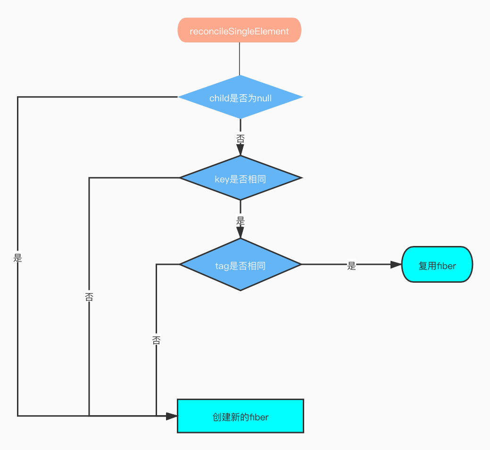

# 概览

从本章开始我们将进入react的diff算法阶段，在正式进入此阶段之前，先了解下react diff算法的设计动机。

## 设计动机

在某一时间节点调用 React 的 `render()` 方法，会创建一棵由 React 元素组成的树。在下一次 state 或 props 更新时，相同的 `render()` 方法会返回一棵不同的树。React 需要基于这两棵树之间的差别来判断如何高效的更新 UI，以保证当前 UI 与最新的树保持同步。

此算法有一些通用的解决方案，即生成将一棵树转换成另一棵树的最小操作次数。然而，即使使用[最优的算法](http://grfia.dlsi.ua.es/ml/algorithms/references/editsurvey_bille.pdf)，该算法的复杂程度仍为 O(n 3 )，其中 n 是树中元素的数量。

如果在 React 中使用该算法，那么展示 1000 个元素则需要 10 亿次的比较。这个开销实在是太过高昂。于是 React 在以下两个假设的基础之上提出了一套 O(n) 的启发式算法：

1. 两个不同类型的元素会产生出不同的树；
2. 开发者可以通过设置 `key` 属性，来告知渲染哪些子元素在不同的渲染下可以保存不变；
3. react不会跨层对比，只会同层对比

在实践中，我们发现以上假设在几乎所有实用的场景下都成立。

> 以上解释来react官网，其中第三点为个人观点

下面我们就进入源码阶段。

## 入口函数

diff的入口函数为`reconcileChildFibers()`，此函数在`reconcileChildren（）`中调用，详细代码入下：

```jsx
export function reconcileChildren(
  current: Fiber | null,
  workInProgress: Fiber,
  nextChildren: any,
  renderLanes: Lanes,
) {
  if (current === null) {
    // mount 阶段
    workInProgress.child = mountChildFibers(
      workInProgress,
      null,
      nextChildren,
      renderLanes,
    );
  } else {
    // diff 入口函数
    workInProgress.child = reconcileChildFibers(
      workInProgress,
      current.child,
      nextChildren,
      renderLanes,
    );
  }
}
```

> `mountChildFibers()`和`reconcileChildFibers()`都是闭包函数`ChildReconciler()`返回值。

`reconcileChildFibers`函数详情：

```jsx
 function reconcileChildFibers(
    returnFiber: Fiber,
    currentFirstChild: Fiber | null,
    newChild: any,
    lanes: Lanes,
  ): Fiber | null {
    const isUnkeyedTopLevelFragment =
      typeof newChild === 'object' &&
      newChild !== null &&
      newChild.type === REACT_FRAGMENT_TYPE &&
      newChild.key === null;
    if (isUnkeyedTopLevelFragment) {
      newChild = newChild.props.children;
    }

    // Handle object types
    const isObject = typeof newChild === 'object' && newChild !== null;

    if (isObject) {
      switch (newChild.$$typeof) {
        case REACT_ELEMENT_TYPE:
          // 处理reconcileSingleElement
          return placeSingleChild(
            reconcileSingleElement(
              returnFiber,
              currentFirstChild,
              newChild,
              lanes,
            ),
          );
        case REACT_PORTAL_TYPE:
          // reconcileSinglePortal
          return placeSingleChild(
            reconcileSinglePortal(
              returnFiber,
              currentFirstChild,
              newChild,
              lanes,
            ),
          );
        case REACT_LAZY_TYPE:
          if (enableLazyElements) {
            const payload = newChild._payload;
            const init = newChild._init;
            // TODO: This function is supposed to be non-recursive.
            return reconcileChildFibers(
              returnFiber,
              currentFirstChild,
              init(payload),
              lanes,
            );
          }
      }
    }

    if (typeof newChild === 'string' || typeof newChild === 'number') {
      // 处理reconcileSingleTextNode
      // ...省略实现
    }

    if (isArray(newChild)) {
      // 处理array的情况
      // ...省略
    }

    

    // Remaining cases are all treated as empty.
    // 如果都没命中，删除节点
    return deleteRemainingChildren(returnFiber, currentFirstChild);
  }

```

> 备注：`reconcileChildFibers()`把Fiber节点的flags设置为Placement：`newFiber.flags = Placement;`

从上述代码可以看出，在`reconcileChildFibers()`中主要处理三中类型的newChild：

- Object：表示为单节点，且不为text的节点
- string|number： 表示当前fiber对应的DOM类型为TextDom
- Array：表示同级有多个节点

```jsx
<ul>
  <li>1</li>
  <li>2</li>
</ul>
```

本章中我们主要讨论两种情况：Object和Array，也就是单节点对比和多节点对比。

## 单节点对比

单节点对比我们主要来看看`newChild.$$typeof === REACT_ELEMENT_TYPE`的情况（即通过react.createElenet创建的节点）。单节点的入口函数为`reconcileSingleElement()`。

```jsx
function reconcileSingleElement(
    returnFiber: Fiber,
    currentFirstChild: Fiber | null,
    element: ReactElement,
    lanes: Lanes,
  ): Fiber {
    const key = element.key;
    let child = currentFirstChild;
    // child !== null 表示当前有界面有渲染节点
    while (child !== null) {
      // child === null 表示上一次更新存在DOM节点，下面的逻辑是用来判断是否可复用
      // 首先进行key的判断，如果key不相等，表示当前child的节点不可复用，直接将child标记为delete状态
      if (child.key === key) {
        switch (child.tag) {
         	// 判断tag
          case Fragment: {
            if (element.type === REACT_FRAGMENT_TYPE) {
              deleteRemainingChildren(returnFiber, child.sibling);
              const existing = useFiber(child, element.props.children);
              existing.return = returnFiber;
              if (__DEV__) {
                existing._debugSource = element._source;
                existing._debugOwner = element._owner;
              }
              return existing;
            }
            break;
          }
          case Block:
            if (enableBlocksAPI) {
              let type = element.type;
              if (type.$$typeof === REACT_LAZY_TYPE) {
                type = resolveLazyType(type);
              }
              if (type.$$typeof === REACT_BLOCK_TYPE) {
                if (
                  ((type: any): BlockComponent<any, any>)._render ===
                  (child.type: BlockComponent<any, any>)._render
                ) {
                  deleteRemainingChildren(returnFiber, child.sibling);
                  const existing = useFiber(child, element.props);
                  existing.type = type;
                  existing.return = returnFiber;
                  if (__DEV__) {
                    existing._debugSource = element._source;
                    existing._debugOwner = element._owner;
                  }
                  return existing;
                }
              }
            }
          default: {
            // 当前节点的tag和current节点的tag是否相同 
            // 相同表示可以复用，进行复用
            // 否则直接删除current节点
            if (
              child.elementType === element.type ||
              (__DEV__
                ? isCompatibleFamilyForHotReloading(child, element)
                : false)
            ) {
              // 删除child的兄弟节点及其子节点
              deleteRemainingChildren(returnFiber, child.sibling);
              const existing = useFiber(child, element.props);
              existing.ref = coerceRef(returnFiber, child, element);
              existing.return = returnFiber;
              if (__DEV__) {
                existing._debugSource = element._source;
                existing._debugOwner = element._owner;
              }
              return existing;
            }
            break;
          }
        }
        // 如果没有匹配到，直接删除
        deleteRemainingChildren(returnFiber, child);
        break;
      } else {
        deleteChild(returnFiber, child);
      }
      child = child.sibling;
    }
		// 根据element进行创建fiber
    if (element.type === REACT_FRAGMENT_TYPE) {
      const created = createFiberFromFragment(
        element.props.children,
        returnFiber.mode,
        lanes,
        element.key,
      );
      created.return = returnFiber;
      return created;
    } else {
      const created = createFiberFromElement(element, returnFiber.mode, lanes);
      created.ref = coerceRef(returnFiber, currentFirstChild, element);
      created.return = returnFiber;
      return created;
    }
  }
```

`reconcileSingleElement()`流程图如下：

> child：上一次更新渲染的节点，也就是当前屏幕上展示的节点

<br>



</br>

现在让我们来分析代码：

- 当`child !== null`且key和tag都相等时，此时会做一下几件事
  1. 调用`deleteRemainingChildren()`删除兄弟节点
  2. 调用`useFiber()`实现fiber节点的复用
  3. 调用`coerceRef()`处理ref
- 当`child !== null`且key相等，tag不相等时，会直接调用`deleteRemainingChildren()`删除当前节点，及其兄弟节点，同时跳出循环，进入创建fiber的流程。
- 当`child === null`时：直接调用`createFiberFromElement()`进行节点的创建。

举个栗子：

```jsx
// 例1
<ul>
  <li></li>
  <li></li>
</ul>

<ul>
  <div></div>
</ul>
// 上面这个栗子中，key是相同的，因为都是undefined，当时tag不同，此时，react会把ul下的所有li删除，同时创建div

// 例2
<ul>
  <li key='1'></li>
  <li key='2'></li>
</ul>

<ul>
  <li key='2'></li>
</ul>
// 当child为第一个时，key不相等，此时将key===1的节点删除，同时child === child.sibling，进行下次迭代，当child.key === 2时，此时key相同，进行复用
```

## 多节点对

多节点diff可以分为如下三种情况：

- 节点属性的更新，包括属性更新，类型更新（li-->div）
- 节点的增减
- 节点的位置变化

多节点无论怎么变都是以上三种情况之一。

多节点的入口函数为`reconcileChildrenArray()`:

```jsx
function reconcileChildrenArray(
    returnFiber: Fiber,
    currentFirstChild: Fiber | null,
    newChildren: Array<*>,
    lanes: Lanes,
  ): Fiber | null {
    // 第一个child fiber，最终返回
    let resultingFirstChild: Fiber | null = null;
    // 中间状态
    let previousNewFiber: Fiber | null = null;

    // 当前的old fiber
    let oldFiber = currentFirstChild;
    let lastPlacedIndex = 0;
    // 当前dom的索引
    let newIdx = 0;
    // 下一个old fiber
    let nextOldFiber = null;
    // 比较更新的情况
    // 在两种情况下会跳出此循环
    // 1、oldFiber.key !== newFiber.key
    // 2、old或者new循环完成
    for (; oldFiber !== null && newIdx < newChildren.length; newIdx++) {
      // 第一次循环
      // ...省略代码
    }

    // new 循环完成，删除剩余old
    if (newIdx === newChildren.length) {
      // We've reached the end of the new children. We can delete the rest.
      deleteRemainingChildren(returnFiber, oldFiber);
      return resultingFirstChild;
    }

    // old 循环完成，将new剩余节点插入
    if (oldFiber === null) {
      // If we don't have any more existing children we can choose a fast path
      // since the rest will all be insertions.
      for (; newIdx < newChildren.length; newIdx++) {
        const newFiber = createChild(returnFiber, newChildren[newIdx], lanes);
        if (newFiber === null) {
          continue;
        }
        lastPlacedIndex = placeChild(newFiber, lastPlacedIndex, newIdx);
        if (previousNewFiber === null) {
          // TODO: Move out of the loop. This only happens for the first run.
          resultingFirstChild = newFiber;
        } else {
          previousNewFiber.sibling = newFiber;
        }
        previousNewFiber = newFiber;
      }
      return resultingFirstChild;
    }

    // old 和 new 都未完成
    // Add all children to a key map for quick lookups.
    // 将old 形成map
    const existingChildren = mapRemainingChildren(returnFiber, oldFiber);

    // Keep scanning and use the map to restore deleted items as moves.
    for (; newIdx < newChildren.length; newIdx++) {
      // 第二次循环
      // 省略代码
    }
    // 将剩余情况删除
    if (shouldTrackSideEffects) {
      // Any existing children that weren't consumed above were deleted. We need
      // to add them to the deletion list.
      existingChildren.forEach(child => deleteChild(returnFiber, child));
    }

    return resultingFirstChild;
  }
```

`reconcileChildrenArray()`函数主要逻辑分为两轮循环，我们知道多节点的更新可以分为三种情况，但三种情况出现的概率是完全不同，其中第一种情况的概率极高，所以react会优先处理第一种情况，也就是第一轮循环。

我们在详细看两轮循环前，先看看前置动作：

```jsx
// 第一个child fiber，最终返回
let resultingFirstChild: Fiber | null = null;
// 中间状态
let previousNewFiber: Fiber | null = null;

// 当前的old fiber
let oldFiber = currentFirstChild;
let lastPlacedIndex = 0;
// 当前dom的索引
let newIdx = 0;
// 下一个old fiber
let nextOldFiber = null;
```

在进行循环之前主要是定义了几个变量：

- resultingFirstChild：对比完成后返回的fiber
- previousNewFiber：中间状态
- oldFiber：即上一次渲染的fiber
- lastPlacedIndex：此值用来潘判断节点是否移动了了，在`placeChild()`使用
- newIdx：新的索引值
- nextOldFiber：下一个fiber

### 第一轮循环

```jsx
for (; oldFiber !== null && newIdx < newChildren.length; newIdx++) {
  		// 此处没有看太明白
      if (oldFiber.index > newIdx) {
        nextOldFiber = oldFiber;
        oldFiber = null;
      } else {
        nextOldFiber = oldFiber.sibling;
      }
  		// 当key不相等时，会返回null
      const newFiber = updateSlot(
        returnFiber,
        oldFiber,
        newChildren[newIdx],
        lanes,
      );
      // 表示key不相等，直接跳出当前循环
      if (newFiber === null) {
        if (oldFiber === null) {
          oldFiber = nextOldFiber;
        }
        break;
      }
      if (shouldTrackSideEffects) {
        if (oldFiber && newFiber.alternate === null) {
          deleteChild(returnFiber, oldFiber);
        }
      }
      lastPlacedIndex = placeChild(newFiber, lastPlacedIndex, newIdx);
      if (previousNewFiber === null) {
        resultingFirstChild = newFiber;
      } else {
        previousNewFiber.sibling = newFiber;
      }
      previousNewFiber = newFiber;
      oldFiber = nextOldFiber;
    }
```

第一轮遍历步骤如下：

- newIdx === 0时，比较oldFiber和newChildren[0]，是否可复用
- 可复用时，newIdx++，同时`oldFiber = nextOldFiber`，进入下一轮循环
- 不可复用：
  1. key不相等时，此时直接跳出，此时可能存在两种情况，位置变换或节点有增加或删除
  2. key相等但tag不同，此时会将oldFiber标记为delete
- oldFiber === null 或 newIdx === newChildren.length时，第一轮循环结束。

> placeChild()是用来标记当前节点是否为插入节点的

### 第二轮循环

#### oldFiber 和 newChildren 同时遍历完成

最理想的情况，此时diff完成

#### oldFiber没有完成，newChildren完成

```jsx
// new 循环完成，删除剩余old
if (newIdx === newChildren.length) {
  // 删除剩余的oldFiber
  deleteRemainingChildren(returnFiber, oldFiber);
  return resultingFirstChild;
}
```

#### oldFiber完成，newChildren没有完成

```jsx
 // old 循环完成，此时只需循环创建newChildren即可
if (oldFiber === null) {
  for (; newIdx < newChildren.length; newIdx++) {
    const newFiber = createChild(returnFiber, newChildren[newIdx], lanes);
    if (newFiber === null) {
      continue;
    }
    lastPlacedIndex = placeChild(newFiber, lastPlacedIndex, newIdx);
    if (previousNewFiber === null) {
      // TODO: Move out of the loop. This only happens for the first run.
      resultingFirstChild = newFiber;
    } else {
      previousNewFiber.sibling = newFiber;
    }
    previousNewFiber = newFiber;
  }
  return resultingFirstChild;
}
```

#### oldFiber 和 newChildren 都没完成

为了方便在O(1)的时间内进行查找，需要将oldFiber转换为Map，

```jsx
const existingChildren = mapRemainingChildren(returnFiber, oldFiber);
```

```jsx
for (; newIdx < newChildren.length; newIdx++) {
  		// 更新节点
      const newFiber = updateFromMap(
        existingChildren,
        returnFiber,
        newIdx,
        newChildren[newIdx],
        lanes,
      );
      if (newFiber !== null) {
        if (shouldTrackSideEffects) {
					// 表示当前节点为复用节点，需要将复用的old节点从existingChildren中删除
          if (newFiber.alternate !== null) {
            existingChildren.delete(
              newFiber.key === null ? newIdx : newFiber.key,
            );
          }
        }
        lastPlacedIndex = placeChild(newFiber, lastPlacedIndex, newIdx);
        if (previousNewFiber === null) {
          resultingFirstChild = newFiber;
        } else {
          previousNewFiber.sibling = newFiber;
        }
        previousNewFiber = newFiber;
      }
    }
```

循环完成后，还有最后一个动作就是，删除existingChildren中剩余节点，至此，diff算法全部完成。

```jsx
// 将剩余情况删除
if (shouldTrackSideEffects) {
  // Any existing children that weren't consumed above were deleted. We need
  // to add them to the deletion list.
  existingChildren.forEach(child => deleteChild(returnFiber, child));
}
```

## placeChild

```jsx

  function placeChild(
    newFiber: Fiber,
    lastPlacedIndex: number,
    newIndex: number,
  ): number {
    newFiber.index = newIndex;
    if (!shouldTrackSideEffects) {
      // Noop.
      return lastPlacedIndex;
    }
    const current = newFiber.alternate;
    if (current !== null) {
      const oldIndex = current.index;
      if (oldIndex < lastPlacedIndex) {
       	// 这块是判断当前节点是否是移动
        newFiber.flags = Placement;
        return lastPlacedIndex;
      } else {
        // This item can stay in place.
        return oldIndex;
      }
    } else {
      // This is an insertion.
      newFiber.flags = Placement;
      return lastPlacedIndex;
    }
  }
```


