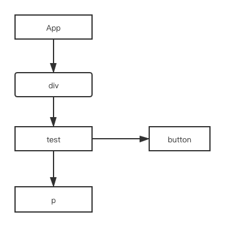

# 冒泡阶段
冒泡阶段的起始函数是`completeUnitOfWork`。

在上一章我们知道了beignWork完成成Fiber节点的创建，diff算法，调用render阶段的部分生命周期函数。

我们这一章将要完成对冒泡阶段全面分析。

let's go

## completeUnitOfWork

- 参数
  1. unitOfWork：render阶段构建的fiber，如果当前节点有子节点，那么子节点已经完成complete
- 行为
  1. 调用completeWork
  2. 生成effectList

我们先来看看completeWork来做什么了，后面我们会详细的来讲effectList。

```javascript
function completeUnitOfWork(unitOfWork: Fiber): void {
    // render完成的fiber
    let completedWork = unitOfWork;
    do {
  		// 当前渲染的节点，如果current为空，表示mount，不为空表示更新
      const current = completedWork.alternate;
      const returnFiber = completedWork.return;
      if ((completedWork.flags & Incomplete) === NoFlags) {
        setCurrentDebugFiberInDEV(completedWork);
        let next;
        if (
          !enableProfilerTimer ||
          (completedWork.mode & ProfileMode) === NoMode
        ) {
          // 创建出更新
          next = completeWork(current, completedWork, subtreeRenderLanes);
        } else {
          // startProfilerTimer 和 stopProfilerTimerIfRunningAndRecordDelta 用来统计当前阶段渲染时间
        	// fiber.actualDuration 和 fiber.selfBaseDuration 变量赋值
          startProfilerTimer(completedWork);
          next = completeWork(current, completedWork, subtreeRenderLanes);
          stopProfilerTimerIfRunningAndRecordDelta(completedWork, false);
        }
        resetCurrentDebugFiberInDEV();

        if (next !== null) {
          workInProgress = next;
          return;
        }

        resetChildLanes(completedWork);
				// 构建effectList
        if (
          returnFiber !== null &&
          (returnFiber.flags & Incomplete) === NoFlags
        ) {
          if (returnFiber.firstEffect === null) {
            returnFiber.firstEffect = completedWork.firstEffect;
          }
          if (completedWork.lastEffect !== null) {
            if (returnFiber.lastEffect !== null) {
              returnFiber.lastEffect.nextEffect = completedWork.firstEffect;
            }
            returnFiber.lastEffect = completedWork.lastEffect;
          }

          const flags = completedWork.flags;
          if (flags > PerformedWork) {
            if (returnFiber.lastEffect !== null) {
              returnFiber.lastEffect.nextEffect = completedWork;
            } else {
              returnFiber.firstEffect = completedWork;
            }
            returnFiber.lastEffect = completedWork;
          }
        }
      } else {
        const next = unwindWork(completedWork, subtreeRenderLanes);
        if (next !== null) {
          next.flags &= HostEffectMask;
          workInProgress = next;
          return;
        }

        if (
          enableProfilerTimer &&
          (completedWork.mode & ProfileMode) !== NoMode
        ) {
          stopProfilerTimerIfRunningAndRecordDelta(completedWork, false);
          let actualDuration = completedWork.actualDuration;
          let child = completedWork.child;
          while (child !== null) {
            actualDuration += child.actualDuration;
            child = child.sibling;
          }
          completedWork.actualDuration = actualDuration;
        }

        if (returnFiber !== null) {
          returnFiber.firstEffect = returnFiber.lastEffect = null;
          returnFiber.flags |= Incomplete;
        }
      }

      const siblingFiber = completedWork.sibling;
      if (siblingFiber !== null) {
        workInProgress = siblingFiber;
        return;
      }
      completedWork = returnFiber;
      workInProgress = completedWork;
    } while (completedWork !== null);
    if (workInProgressRootExitStatus === RootIncomplete) {
      workInProgressRootExitStatus = RootCompleted;
    }
}
```

## completeWork

- 参数
  1. current：当前渲染的fiber
  2. workInProgress：workInProgress中的fiber
  3. renderLanes：lane优先级

根据代码我们可以看出，`completeWork`函数，主要是根据tag，处理不同类型的Component，很多类型Component是直接返回的，主要处理的是可以生成DOM的component。

我们以HostComponent（原生DOM节点）为例进行讲解，有代码可以看出，整个过程可以分为两部分：

- current !== null 表示update
- current === null 表示mount

```javascript
function completeWork(
  current: Fiber | null,
  workInProgress: Fiber,
  renderLanes: Lanes,
): Fiber | null {
  const newProps = workInProgress.pendingProps;

  switch (workInProgress.tag) {
    case IndeterminateComponent:
    case LazyComponent:
    case SimpleMemoComponent:
    case FunctionComponent:
    case ForwardRef:
    case Fragment:
    case Mode:
    case Profiler:
    case ContextConsumer:
    case MemoComponent:
      return null;
    case ClassComponent: {
      const Component = workInProgress.type;
      if (isLegacyContextProvider(Component)) {
        popLegacyContext(workInProgress);
      }
      return null;
    }
    // ...省略
    // HostComponent
    case HostComponent: {
      popHostContext(workInProgress);
      const rootContainerInstance = getRootHostContainer();
      const type = workInProgress.type;
      if (current !== null && workInProgress.stateNode != null) {
        // update 节点
      } else {
       // mount 节点
     }
     // ...省略case
  }
}
```

### update

update时表示当前节点已经有DOM渲染了，也就是说存在原生DOM了，此时我们不需要进行DOM的创建了，只需要更新DOM的属性就好。`updateHostComponent`进行更新。

```javascript
if (current !== null && workInProgress.stateNode != null) {
  	// 更新DOM属性
    updateHostComponent(
      current,
      workInProgress,
      type,
      newProps,
      rootContainerInstance,
    );

    if (current.ref !== workInProgress.ref) {
      markRef(workInProgress);
    }
}
```

#### updateHostComponent

- 参数
  1. current：当前渲染的fiber
  2. workInProgress：workInProgress fiber
  3. type：tagName
  4. newProps：newProps
  5. rootContainerInstance

`updateHostComponent`最主要的功能就是处理props，并将处理的结果赋值给`workInProgress.updateQueue`。`prepareUpdate` 函数只是调用了`diffProperties`函数，接下来我们看看``函数。

```tsx
updateHostComponent = function(
    current: Fiber,
    workInProgress: Fiber,
    type: Type,
    newProps: Props,
    rootContainerInstance: Container,
  ) {
  		// 渲染的props
      const oldProps = current.memoizedProps;
  		// 浅比较
      if (oldProps === newProps) {
        return;
      }
      const instance: Instance = workInProgress.stateNode;
      const currentHostContext = getHostContext();
      const updatePayload = prepareUpdate(
        instance,
        type,
        oldProps,
        newProps,
        rootContainerInstance,
        currentHostContext,
      );
      workInProgress.updateQueue = (updatePayload: any);
      if (updatePayload) {
        markUpdate(workInProgress);
      }
  };
```

#### diffProperties

- 参数
  1. domElement：dom实例
  2. tag：tagName
  3. lastRawProps：渲染的props
  4. nextRawProps：当前的props

在`diffProperties`函数中主要有两个for循环组成，第一个for是为了处理已删除的props，也就是当前dom渲染出来的属性，但下次渲染此属性下次渲染将要删除，这样的情况会在updatePayload中push propKey和null。第二个for循环是处理修改或添加属性。

> updatePayload的类型位Array，奇数位为propKey，偶数位为propValue

```tsx
export function diffProperties(
  domElement: Element,
  tag: string,
  lastRawProps: Object,
  nextRawProps: Object,
  rootContainerElement: Element | Document,
): null | Array<mixed> {
  // ...省略
  let updatePayload: null | Array<any> = null;
  let lastProps: Object;
  let nextProps: Object;
  switch (tag) {
    // ...省略case
  }

  assertValidProps(tag, nextProps);

  let propKey;
  let styleName;
  let styleUpdates = null;
  // 处理渲染有的属性，且当前props没有的情况，将updatePayload添加[key,null]
  for (propKey in lastProps) {
    if (
      nextProps.hasOwnProperty(propKey) ||
      !lastProps.hasOwnProperty(propKey) ||
      lastProps[propKey] == null
    ) {
      continue;
    }
    // ...省略if分支
    else {
      // For all other deleted properties we add it to the queue. We use
      // the allowed property list in the commit phase instead.
      (updatePayload = updatePayload || []).push(propKey, null);
    }
  }
  // 更新属性
  for (propKey in nextProps) {
    const nextProp = nextProps[propKey];
    const lastProp = lastProps != null ? lastProps[propKey] : undefined;
    if (
      !nextProps.hasOwnProperty(propKey) ||
      nextProp === lastProp ||
      (nextProp == null && lastProp == null)
    ) {
      continue;
    }
    // 省略if分支...
    else {
      (updatePayload = updatePayload || []).push(propKey, nextProp);
    }
  }
  if (styleUpdates) {
    if (__DEV__) {
      validateShorthandPropertyCollisionInDev(styleUpdates, nextProps[STYLE]);
    }
    (updatePayload = updatePayload || []).push(STYLE, styleUpdates);
  }
  return updatePayload;
}
```

#### 总结

在update阶段，`workInProgress.updateQueue`生成数据，数据会在commit阶段进行更新处理。

### mount

mount主要完成以下几件事

1. 创建DOM实例
2. 将当前节点的children节点，插入到当前节点中，性能优化。可以将本次节点以及子节点可以一次性插入到页面页面中
3. 在`finalizeInitialChildren`函数中会初始化属性和挂载相应的事件

```tsx
// 创建DOM实例
const instance = createInstance(
    type,
    newProps,
    rootContainerInstance,
    currentHostContext,
    workInProgress,
);
// 将子节点添加到当前节点
appendAllChildren(instance, workInProgress, false, false);

workInProgress.stateNode = instance;
// 设置属性
if (
  finalizeInitialChildren(
    instance,
    type,
    newProps,
    rootContainerInstance,
    currentHostContext,
  )
) {
  	markUpdate(workInProgress); 
	}
}

```

## effect list

现在render阶段就剩下一件事了，那就是生成effect list。那么为什么要生成effec list呢，总结一句话就是为了效率。因为在commit阶段我们要找到所有fiber带有effect tag的节点，如果我们不生成effect list，那么我们就要对整个fiber进行遍历了，这当然是不可以接受的。所以我们render阶段形成一条更新链表。

effect list 相关的属性主要是：

```tsx
// 下个节点
nextEffect: Fiber | null,
// 要更新的第一个节点
firstEffect: Fiber | null,
// 更新的最后一个节点
lastEffect: Fiber | null,
```

那么effect list怎么形成的呢？

- 处理子节点
  1. 处理父节点的`firstEffect`，如果`returnFiber.firstEffect === null`则将当前节点的`firstEffect`赋值给父节点。注意这是在commit阶段处理的第一个节点
  2. 处理父节点`lastEffect`
- 处理当前节点
  1. 讲当前节点加入到effect list中

```tsx
if (returnFiber !== null && (returnFiber.flags & Incomplete) === NoFlags) {
    // 处理child节点
    if (returnFiber.firstEffect === null) {
      returnFiber.firstEffect = completedWork.firstEffect;
    }
    if (completedWork.lastEffect !== null) {
      if (returnFiber.lastEffect !== null) {
        returnFiber.lastEffect.nextEffect = completedWork.firstEffect;
      }
      returnFiber.lastEffect = completedWork.lastEffect;
    }
    const flags = completedWork.flags;
  	// 讲当前节点加入加入到effect中
    if (flags > PerformedWork) {
      if (returnFiber.lastEffect !== null) {
        returnFiber.lastEffect.nextEffect = completedWork;
      } else {
        returnFiber.firstEffect = completedWork;
      }
      returnFiber.lastEffect = completedWork;
    }
}
```

讲到这里你可能还是不理解这个链表怎么形成的，举个栗子来说明，如下图：

<br>



</br>


整个流程如下：

- p节点complete，此时`returnFiber`为test节点 
  1. `returnFiber`的`firstEffect`为null，`returnFiber.firstEffect = completedWork.firstEffect`，completedWork.firstEffect === null，所以赋值完成后`returnFiber.firstEffect` === null
  2. `returnFiber.firstEffect = completedWork`
  3. `returnFiber.lastEffect = completedWork`

<br>

​	

</br>

- button 节点 complete，此时`returnFiber`为test节点 
  1. `returnFiber.lastEffect.nextEffect = completedWork`，也就是说，p.nextEffect = button
  2. `returnFiber.lastEffect = completedWork`，texst.lastEffect = button

<br>

​	

</br>


- test 节点 complete，此时`returnFiber`为div节点 
  1. ` returnFiber.firstEffect = completedWork.firstEffect`，即：div.firstEffect= p
  2. `returnFiber.lastEffect = completedWork.lastEffect`,  即：div.lastEffect = button
  3. `returnFiber.lastEffect.nextEffect = completedWork`，即：button.next = test
  4. returnFiber.lastEffect = completedWork，即：div.lastEffect = test

<br>

​	

</br>

- div 节点 complete，此时`returnFiber`为app节点 
  1. ` returnFiber.firstEffect = completedWork.firstEffect`，即：app.firstEffect= p
  2. `returnFiber.lastEffect = completedWork.lastEffect`，即：app.lastEffect = test
  3. `returnFiber.lastEffect.nextEffect = completedWork`，即：test.next = div
  4. `returnFiber.lastEffect = completedWork`，即：app.lastEffect= div

<br>

​	

</br>

## 总结

至此我们在commit阶段的工作全部完成，有上述effectList可以看出，firstEffect节点为P节点，也就是说，在commit阶段的更新是从下向上的更新（简而言之，子组件的`componentDidUpdate`生命周期比父组件早调用）。

下一章我们进行遗留问题，diff算法的学习

