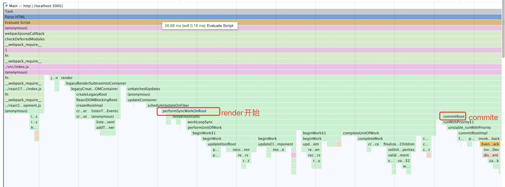

# 概览

本章我们将要揭开render的神秘面纱，揭示React render阶段是怎样构建Fiber树。

首先，我们来看下render的调用栈：

<br>



</br>

render阶段始于performSyncWorkOnRoot（同步更新）或performConcurrentWorkOnRoot（异步更新）方法。

两个方法最终调用到workLoopSync或workLoopConcurrent两个函数，如下：

```javascript
// 同步更新
function workLoopSync() {
  while (workInProgress !== null) {
    performUnitOfWork(workInProgress);
  }
}
// 异步更新
function workLoopConcurrent() {
  while (workInProgress !== null && !shouldYield()) {
    performUnitOfWork(workInProgress);
  }
}
```

从代码中我们可以看出，更新过程中都会判断`workInProgress`，而异步更新会调用`shouldYield()`函数的判断（Concurrent模式主要逻辑代码）。

- `workInProgress`：表示在内存中正在构建的fiber树，在`performUnitOfWork`中会创建子节点fiber，并将子节点fiber赋值给`workInProgress`（深度优先的遍历）
- shouldYield：表示的函数为`shouldYieldToHost`

```javascript
shouldYieldToHost = function() {
      const currentTime = getCurrentTime();
      if (currentTime >= deadline) {
        if (needsPaint || scheduling.isInputPending()) {
          return true;
        }
        return currentTime >= maxYieldInterval;
      } else {
        return false;
      }
    };
```

在shouldYield()函数中会判断curentTime>=deadline，如果成立则终止当前更新，将控制权交换给浏览器。

> 本章以同步流程来讲解的，后期在讲解Concurrent时再引入异步

下面我们来粗略的了解下`performUnitOfWork`函数：
```javascript
function performUnitOfWork(unitOfWork: Fiber): void {
  const current = unitOfWork.alternate;
  setCurrentDebugFiberInDEV(unitOfWork);

  let next;
  if (enableProfilerTimer && (unitOfWork.mode & ProfileMode) !== NoMode) {
    // 开始渲染时间
    startProfilerTimer(unitOfWork);
    // 构建workInProgress
    next = beginWork(current, unitOfWork, subtreeRenderLanes);
    // 本次渲染所用时间
    stopProfilerTimerIfRunningAndRecordDelta(unitOfWork, true);
  } else {
    next = beginWork(current, unitOfWork, subtreeRenderLanes);
  }

  resetCurrentDebugFiberInDEV();
  // 保存本次的props，下次更新对比用
  unitOfWork.memoizedProps = unitOfWork.pendingProps;
  if (next === null) {
    // If this doesn't spawn new work, complete the current work.
    // 表示如果当前节点没有子节点，直接将当前节点complate
    // 完成effectList 链表的创建
    completeUnitOfWork(unitOfWork);
  } else {
    workInProgress = next;
  }

  ReactCurrentOwner.current = null;
}
```

performUnitOfWork函数最主要的功能就是调用`beginWork()`和  `completeUnitOfWork()`两个函数。`beginWork()`为捕获阶段，此阶段会采取深度优先的方式遍历节点，并完成Fiber树创建以及diff算法。`completeUnitOfWork()`为冒泡阶段，此阶段要完成生命周期（部分）的调用，形成effectlist等。

## 捕获阶段

在捕获阶段，会深度优先遍历每个节点，并在遍历过程中调用`beginWork()`，在此方法中完成fiber树的构建以及diff算法（diff算法会在后面详细讲解）。fiber树的创建可分为两种情况：

- 如果fiber.alternate == null, fiber会根据JSX数据进行创建，表示当前节点没有已渲染的节点与之相对应。
- 如果fiber.alternate != null，fiber会复用fiber.alternate，并根据JSX重新赋值，表示当前节点有与之相对应的渲染节点。

当捕获阶段递归到叶节点时，会向上冒泡，那么我们来看看冒泡阶段。

## 冒泡阶段

在冒泡阶段的入口函数为`completeUnitOfWork()`，在此函数中完成部分生命周期调用，effectList创建等，会判断当前fiber是否存在兄弟节点，如果存在则兄弟节点进入捕获阶段，如果不存则进入父节点的冒泡阶段。

那么捕获和冒泡具体过程是什么样的呢？请看下面的例子：

```javascript
function App() {
    return (
      <div>
        <p>{this.state.count}</p>
        <button >click me</button>
      </div>
    )
}
ReactDOM.render(
  <App />,
  document.getElementById('root')
);

```

<br>


</br>

- 第一步：FiberRoot beignwork
- 第二步：App Fiber beignWork
- 第三步：div Fiber beignWork
- 第四步：p Fiber beignWork
- 第五步：因为p节点之后文本子节点，react会进行优化，直接进行completeUnitOfWork阶段，完成后将workInProgress设置为button fiber
- 第六步：button Fiber beignWork
- 第七步：同第五步p节点的优化，button会直接completeUnitOfWork阶段
- 第八步：div completeUnitOfWork
- 第九步：App completeUnitOfWork
- 第十步：FiberRoot completeUnitOfWork

## 总结

本章大致了解render阶段主要功能，下一章我们将开始render过程中的细节讲解
> 本文章有部分参考[React技术揭秘](https://react.iamkasong.com/)


