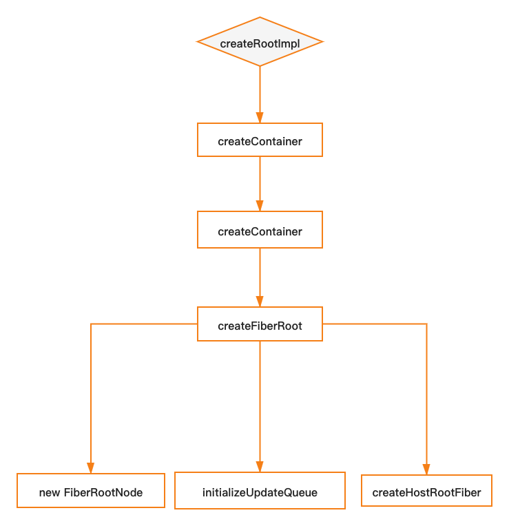
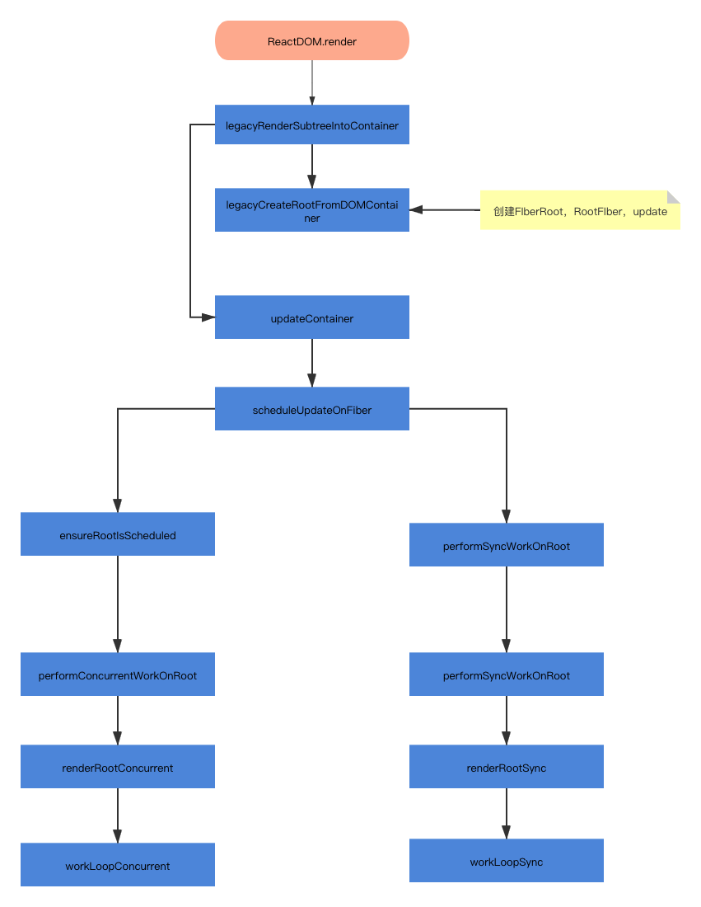

# 渲染及更新
经过前面这么多章的铺垫，今天我们终于可以看看React的起点`ReactDOM.render`，在React18之前这是唯一入口函数，在React18中新增了`createRoot().render()`入口。

> `ReactDOM.render`函数创建的程序都是legacy模式，而有`createRoot().render()`创建的程序为concurrent模式。

那么我们下面来看看两种模式入口的异同

## Legacy模块

Legacy模块是React18之前一直采取的模式，主要是同步更新。其模式的入口为`ReactDOM.render`

```tsx
export function render(
  element: React$Element<any>,
  container: Container,
  callback: ?Function,
) {
	// ...忽略部分代码
  // 创建fiberRoot和rootFiber
  return legacyRenderSubtreeIntoContainer(
    null,
    element,
    container,
    false,
    callback,
  );
}
```

可以看出render函数极其简单，只是调用Legacy模式的入口函数`legacyRenderSubtreeIntoContainer`。

render函数共有三个参数：

- element：是我们创建的App应用
- container：DOM 容器
- callback：首次渲染完成后，会调用callback

### 入口

作为legacy模式入口函数`legacyRenderSubtreeIntoContainer`做什么了呢？`legacyRenderSubtreeIntoContainer`函数主要做一下几件事：

- 调用`legacyCreateRootFromDOMContainer`创建FiberRoot和rootFiber，FiberRoot全局唯一，而rootFiber不一定
- 判断是否为mount阶段，如果为mount阶段，创建FiberRoot，并将FiberRoot挂载到container上
- 如果有callback函数，处理callback函数的this问题
- 调用`updateContainer`，启动后续流程

```tsx
function legacyRenderSubtreeIntoContainer(
  parentComponent: ?React$Component<any, any>,
  children: ReactNodeList,
  container: Container,
  forceHydrate: boolean,
  callback: ?Function,
) {
  if (__DEV__) {
    topLevelUpdateWarnings(container);
    warnOnInvalidCallback(callback === undefined ? null : callback, 'render');
  }

  // TODO: Without `any` type, Flow says "Property cannot be accessed on any
  // member of intersection type." Whyyyyyy.
  let root: RootType = (container._reactRootContainer: any);
  let fiberRoot;
  // 根据root是否存在，判断是否更新或mount
  if (!root) {
    // Initial mount
    // container默认会挂载FiberRoot
    root = container._reactRootContainer = legacyCreateRootFromDOMContainer(
      container,
      forceHydrate,
    );
    // fiberRoot
    fiberRoot = root._internalRoot;
    if (typeof callback === 'function') {
      const originalCallback = callback;
      callback = function() {
        const instance = getPublicRootInstance(fiberRoot);
        originalCallback.call(instance);
      };
    }
    // Initial mount should not be batched.
    unbatchedUpdates(() => {
      updateContainer(children, fiberRoot, parentComponent, callback);
    });
  } else {
    // 当前fiberRoot
    fiberRoot = root._internalRoot;
    if (typeof callback === 'function') {
      const originalCallback = callback;
      callback = function() {
        const instance = getPublicRootInstance(fiberRoot);
        originalCallback.call(instance);
      };
    }
    // Update
    updateContainer(children, fiberRoot, parentComponent, callback);
  }
  return getPublicRootInstance(fiberRoot);
}
```

### FiberRoot和RootFiber创建

```tsx
legacyCreateRootFromDOMContainerfunction legacyCreateRootFromDOMContainer(
  container: Container,
  forceHydrate: boolean,
): RootType {
  // 判断当前模式是否为ssr
  const shouldHydrate =
    forceHydrate || shouldHydrateDueToLegacyHeuristic(container);
  // First clear any existing content.
  if (!shouldHydrate) {
    let warned = false;
    let rootSibling;
    while ((rootSibling = container.lastChild)) {
      // ...省略dev代码
      // 删除container中的children
      container.removeChild(rootSibling);
    }
  }
  // ...省略dev代码
	// 创建fiberRoot
  return createLegacyRoot(
    container,
    shouldHydrate
      ? {
          hydrate: true,
        }
      : undefined,
  );
}

export function createLegacyRoot(
  container: Container,
  options?: RootOptions,
): RootType {
  // 创建RootFiber，并且模式为LegacyRoot
  return new ReactDOMBlockingRoot(container, LegacyRoot, options);
}
```

> FiberRoot和RootFiber是相互引用的，FiberRoot.current -> RootFiber，而RootFiber.stateNode -> FiberRoot

在`ReactDOMBlockingRoot`函数中调用链如下：

<br>



</br>

> 在new ReactDOMBlockingRoot时，传入的模式为LegacyRoot

在`createFiberRoot`函数中会调用`new FiberRootNode`创建FiberRoot，调用`createHostRootFiber`创建rootFiber，同时调用`initializeUpdateQueue`来初始化RootFiber的`UpdateQueue`类型。

至此我们初始化工作完成，下面我们将进行update的创建，触发一次新的更新

### update

update的入口函数为`updateContainer`，代码如下：

```tsx
unbatchedUpdates(() => {
  // 调用updateContainer，创建update，触发一次更新
  updateContainer(children, fiberRoot, parentComponent, callback);
});


export function updateContainer(
  element: ReactNodeList,
  container: OpaqueRoot,
  parentComponent: ?React$Component<any, any>,
  callback: ?Function,
): Lane {
  // ...省略dev
  // root Fiber
  const current = container.current;
  const eventTime = requestEventTime();
  // ...省略dev
  // 获取更新优先级
  const lane = requestUpdateLane(current);

  if (enableSchedulingProfiler) {
    markRenderScheduled(lane);
  }
	// 处理context
  const context = getContextForSubtree(parentComponent);
  if (container.context === null) {
    container.context = context;
  } else {
    container.pendingContext = context;
  }

  // ...省略dev

  // 创建update
  const update = createUpdate(eventTime, lane);
  // update payload 为app
  update.payload = {element};
	// 处理callback
  callback = callback === undefined ? null : callback;
  if (callback !== null) {
    if (__DEV__) {
      if (typeof callback !== 'function') {
        console.error(
          'render(...): Expected the last optional `callback` argument to be a ' +
            'function. Instead received: %s.',
          callback,
        );
      }
    }
    update.callback = callback;
  }
	// 将update加入到updateQueue
  enqueueUpdate(current, update);
  // 调度更新
  scheduleUpdateOnFiber(current, lane, eventTime);

  return lane;
}
```

`updateContainer`主要做一下几件事：

- 获取本次更新的lane优先级
- 处理context
- 调用`createUpdate`创建update
- 调用`enqueueUpdate`将update加入到updateQueue中
- 调度更新（`scheduleUpdateOnFiber`）

### 调度更新

在react中所有的更新都要走调度系统，而调度系统入口就是`scheduleUpdateOnFiber`。此函数比较复杂，我会对代码进行注释：

```tsx
export function scheduleUpdateOnFiber(
  fiber: Fiber,
  lane: Lane,
  eventTime: number,
) {
  // 检测代码，可以忽略
  checkForNestedUpdates();
  warnAboutRenderPhaseUpdatesInDEV(fiber);

  // 获取到fiberroot,react中，所有的更新都是从root开始的
  const root = markUpdateLaneFromFiberToRoot(fiber, lane);
  // 如果fiberroot为null，直接跳出当前更新
  if (root === null) {
    warnAboutUpdateOnUnmountedFiberInDEV(fiber);
    return null;
  }

  // Mark that the root has a pending update.
  // 将root设置为待更新的状态
  markRootUpdated(root, lane, eventTime);
  // 这个if条件是为了处理渲染中断的情况，后期讲concurrent的时候，会详细讲这块
  if (root === workInProgressRoot) {
    // Received an update to a tree that's in the middle of rendering. Mark
    // that there was an interleaved update work on this root. Unless the
    // `deferRenderPhaseUpdateToNextBatch` flag is off and this is a render
    // phase update. In that case, we don't treat render phase updates as if
    // they were interleaved, for backwards compat reasons.
    if (
      deferRenderPhaseUpdateToNextBatch ||
      (executionContext & RenderContext) === NoContext
    ) {
      workInProgressRootUpdatedLanes = mergeLanes(
        workInProgressRootUpdatedLanes,
        lane,
      );
    }
    if (workInProgressRootExitStatus === RootSuspendedWithDelay) {
      // The root already suspended with a delay, which means this render
      // definitely won't finish. Since we have a new update, let's mark it as
      // suspended now, right before marking the incoming update. This has the
      // effect of interrupting the current render and switching to the update.
      // TODO: Make sure this doesn't override pings that happen while we've
      // already started rendering.
      markRootSuspended(root, workInProgressRootRenderLanes);
    }
  }

  // 获取当前的优先级，react有五个优先级，后期在前concurrent模式的时候会讲
  // 没有优先级
	// export const NoPriority = 0;
	// 立即执行的优先级，同步执行的优先级
	// export const ImmediatePriority = 1;
	// 用户优先级，用户触发的优先级
	// export const UserBlockingPriority = 2;
	// 正常优先级，比如：请求数据
	// export const NormalPriority = 3;
 	// 低优先级
	// export const LowPriority = 4;
	// 空闲优先级
	// export const IdlePriority = 5;
  const priorityLevel = getCurrentPriorityLevel();
	// 同步任务
  if (lane === SyncLane) {
    if (
      // Check if we're inside unbatchedUpdates
      (executionContext & LegacyUnbatchedContext) !== NoContext &&
      // Check if we're not already rendering
      // 表示尚未渲染
      (executionContext & (RenderContext | CommitContext)) === NoContext
    ) {
      // Register pending interactions on the root to avoid losing traced interaction data.
      schedulePendingInteractions(root, lane);

      // This is a legacy edge case. The initial mount of a ReactDOM.render-ed
      // root inside of batchedUpdates should be synchronous, but layout updates
      // should be deferred until the end of the batch.
      // 同步更新
      // root -> fiberRoot.current
      performSyncWorkOnRoot(root);
    } else {
      ensureRootIsScheduled(root, eventTime);
      schedulePendingInteractions(root, lane);
      if (executionContext === NoContext) {
        // Flush the synchronous work now, unless we're already working or inside
        // a batch. This is intentionally inside scheduleUpdateOnFiber instead of
        // scheduleCallbackForFiber to preserve the ability to schedule a callback
        // without immediately flushing it. We only do this for user-initiated
        // updates, to preserve historical behavior of legacy mode.
        resetRenderTimer();
        flushSyncCallbackQueue();
      }
    }
  } else { // 异步任务
    // Schedule a discrete update but only if it's not Sync.
    if (
      (executionContext & DiscreteEventContext) !== NoContext &&
      // Only updates at user-blocking priority or greater are considered
      // discrete, even inside a discrete event.
      (priorityLevel === UserBlockingSchedulerPriority ||
        priorityLevel === ImmediateSchedulerPriority)
    ) {
      // This is the result of a discrete event. Track the lowest priority
      // discrete update per root so we can flush them early, if needed.
      if (rootsWithPendingDiscreteUpdates === null) {
        rootsWithPendingDiscreteUpdates = new Set([root]);
      } else {
        rootsWithPendingDiscreteUpdates.add(root);
      }
    }
    // 异步更新任务的入口，此函数中会调用performConcurrentWorkOnRoot
    ensureRootIsScheduled(root, eventTime);
    schedulePendingInteractions(root, lane);
  }

  // We use this when assigning a lane for a transition inside
  // `requestUpdateLane`. We assume it's the same as the root being updated,
  // since in the common case of a single root app it probably is. If it's not
  // the same root, then it's not a huge deal, we just might batch more stuff
  // together more than necessary.
  mostRecentlyUpdatedRoot = root;
}
```

至此为止，我们的流程可以全部串起来了，整个流程如下：

<br>



</br>

## 其他模式

React18以后React将有三种模式：

- legacy： ReactDOM.render入口创建的模式
- blocking：开启部分`concurrent`模式特性的中间模式。目前正在实验中。作为迁移到`concurrent`模式的第一个步骤。
- concurrent：由`createRoot().render()`创建的模式。面向未来的开发模式。我们之前讲的`任务中断/任务优先级`都是针对`concurrent`模式。

以上三种模式的支持：

|                                                              | legacy | blocking | concurrent |
| ------------------------------------------------------------ | ------ | -------- | ---------- |
| String Refs                                                  | ✓      |          |            |
| [Legacy Context](https://zh-hans.reactjs.org/docs/legacy-context.html) | ✓      |          |            |
| [findDOMNode](https://zh-hans.reactjs.org/docs/strict-mode.html#warning-about-deprecated-finddomnode-usage) | ✓      |          |            |
| [Suspense](https://zh-hans.reactjs.org/docs/concurrent-mode-suspense.html#what-is-suspense-exactly) | ✓      | ✓        | ✓          |
| [SuspenseList](https://zh-hans.reactjs.org/docs/concurrent-mode-patterns.html#suspenselist) |        | ✓        | ✓          |
| Suspense SSR + Hydration                                     |        | ✓        | ✓          |
| Progressive Hydration                                        |        | ✓        | ✓          |
| Selective Hydration                                          |        |          | ✓          |
| Cooperative Multitasking                                     |        |          | ✓          |
| Automatic batching of multiple setStates                     |        | ✓        | ✓          |
| [Priority-based Rendering](https://zh-hans.reactjs.org/docs/concurrent-mode-patterns.html#splitting-high-and-low-priority-state) |        |          | ✓          |
| [Interruptible Prerendering](https://zh-hans.reactjs.org/docs/concurrent-mode-intro.html#interruptible-rendering) |        |          | ✓          |
| [useTransition](https://zh-hans.reactjs.org/docs/concurrent-mode-patterns.html#transitions) |        |          | ✓          |
| [useDeferredValue](https://zh-hans.reactjs.org/docs/concurrent-mode-patterns.html#deferring-a-value) |        |          | ✓          |
| [Suspense Reveal "Train"](https://zh-hans.reactjs.org/docs/concurrent-mode-patterns.html#suspense-reveal-train) |        |          | ✓          |

## this.setState

有了前面的支持，我们理解setState就很容易了。

```tsx
Component.prototype.setState = function(partialState, callback) {
  invariant(
    typeof partialState === 'object' ||
      typeof partialState === 'function' ||
      partialState == null,
    'setState(...): takes an object of state variables to update or a ' +
      'function which returns an object of state variables.',
  );
  this.updater.enqueueSetState(this, partialState, callback, 'setState');
};
```

有上面的代码，可以看出，setState最终会调用`this.updater.enqueueSetState`，下面我们看`this.updater.enqueueSetState`函数。

`this.updater.enqueueSetState`函数在`ReactFiberClassComponent.*.js`中，代码如下：

```tsx
enqueueSetState(inst, payload, callback) {
    const fiber = getInstance(inst);
    const eventTime = requestEventTime();
    const lane = requestUpdateLane(fiber);

    const update = createUpdate(eventTime, lane);
    update.payload = payload;
    if (callback !== undefined && callback !== null) {
      if (__DEV__) {
        warnOnInvalidCallback(callback, 'setState');
      }
      update.callback = callback;
    }

    enqueueUpdate(fiber, update);
    scheduleUpdateOnFiber(fiber, lane, eventTime);

    if (__DEV__) {
      if (enableDebugTracing) {
        if (fiber.mode & DebugTracingMode) {
          const name = getComponentName(fiber.type) || 'Unknown';
          logStateUpdateScheduled(name, lane, payload);
        }
      }
    }

    if (enableSchedulingProfiler) {
      markStateUpdateScheduled(fiber, lane);
    }
  },
```

由代码可以看出，在`enqueueSetState`只做了两件事：

- 创建update
- 调用`scheduleUpdateOnFiber`

至此，我们更新流程全部完成，下一章我们就进入Hooks
